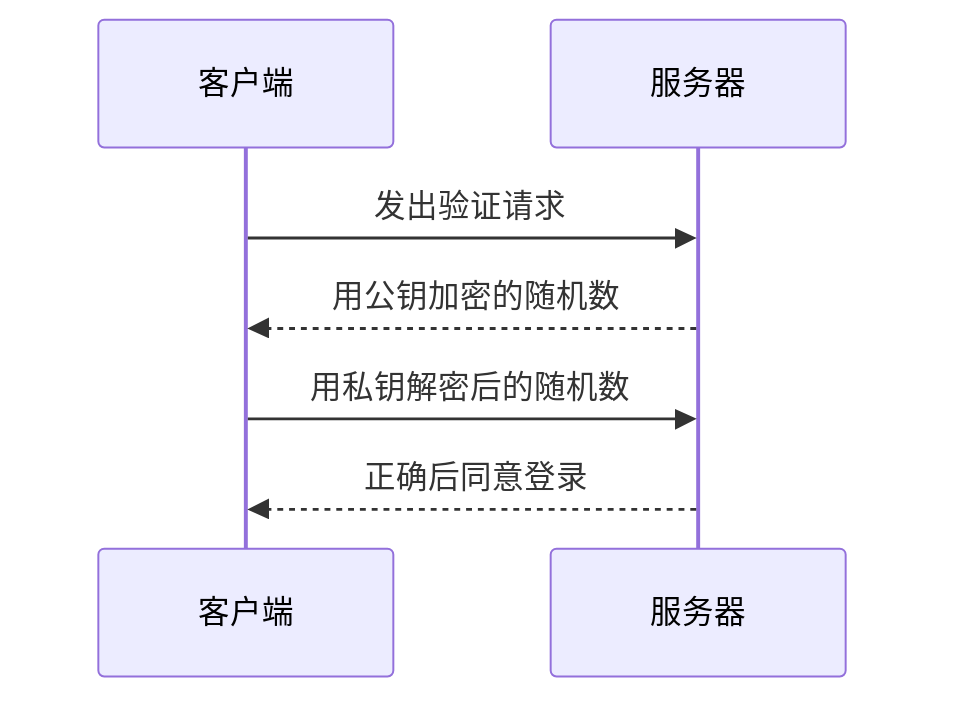
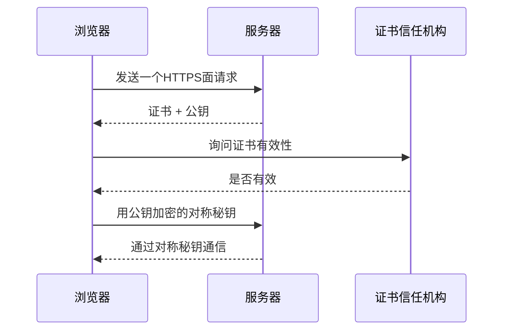

# Day01 网络、HTTP、HTTPS
全栈然叔

---

# 然叔在面试课上的原则
- 有问必答 提到https://github.com/su37josephxia/frontend-interview/issues
- Show me your code - 用代码解释 + 测试驱动TDD
- 优秀是一种习惯 --  带大家养成习惯

---

# 面试课安排

### Lesson01 网络（HTTP2，HTTPS）
    - 网络基础、OSI七层、TCP与UDP、三次握手
    - HTTP、HTTPS、HTTP2、HTTP3
    - CDN、RPC
    - 网络安全XSS、CSRF、


### Lesson02 浏览器、HTML、性能优化

    - 浏览器、渲染过程、回流与重绘、Dom操作、虚拟Dom
    - 事件流、冒泡、捕获、委托
    - 异步加载、图片懒加载、缓存、存储
    - HTML5特性、语义化标签、Serviceworker、编程式Cache
    - 手写HTTP、强/协商缓存、跨域九法、Websocket、GraphQL、RPC

### Lesson03 工程化与构建工具
    - 工程化概念、软件声明周期
    - 测试驱动开发
    - webpack、概念、原理、优化
    - Babel与AST
    - 如何完成类库封装、
    - CI与CD
    - Bundless与Vite

---

# 预习内容

- 手写HTTP协议 [课件](https://juejin.cn/post/7038627294197317662) [代码](https://github.com/su37josephxia/wheel-awesome/tree/master/03-wheel/http-server)

- HTTP协议思维脑图 https://www.processon.com/view/link/5ec52841e0b34d5f261e14e0

- 蛋老师的图解HTTP https://www.bilibili.com/video/BV18h41187Ep

- Eventloop https://www.processon.com/view/link/5e70b1c2e4b011fcce9b89b5
  
---

# Lesson02 网络（HTTP，HTTPS）

## 课程内容

    - OSI七层与TCP/IP
    - TCP与HTTP关系:  手写HTTP (代码演示10min)
    - HTTP精通
      - 鉴权(token/cookie-session)  (代码演示)
      - 跨域的11种方法 (代码演示)
      - 缓存 (代码演示)
      - Gzip (代码演示)
    - HTTPS与加密技术
      - 非对称秘钥
      - SSH的应用
      - HTTPS与证书
    - Websocket
    - 了解CDN (阿里云演示)
    - RPC (代码演示)
    - VPN与网络隧道技术、暗网 (后续B栈代码演示)
    - 新技术展望 HTTP2、HTTP3

---

## 

## 如何系统的掌握网络知识

### OSI七层与TCP/IP

第一步我们要先找到我们应该在哪做这个游戏，要不然是不是就是神仙打架。


我们知道网络其实就是使用最少两根导线，将多个网络节点连接起来交换数据。


可想而知，两个儿子还要打架，那么成千上万的计算机如果要保证他们不打架和平相处，就需要复杂的协议支撑。


在计算机世界中如果一个复杂问题通常的解决方式就是分层解决


其实这个就是OSI参考模型，而实际我们现在的互联网世界是就是这个理论模型的落地叫做TCP/IP协议


### 前端考试范围

- 网络基础 (了解)
- TCP与UDP (掌握)
- HTTP (精通)


### IP 协议

在几十年前，每个大学或者机构自身会有一个局域网，没有所谓的互联网。为了让不同局域网的计算机能连接起来，IP 协议出现了。它定义了每个在互联网上的设备都有一个 **IP 地址**，这个 IP 地址是由 32 位，也就是 4 个字节组成的。最常见的地址表达形式是，每个字节用十进制表示，例如 00000010 => 2，11000000 => 192，然后每个字节用"."分开，所以我们看到的 IP 地址都是用形如 192.168.0.1 的形式来表示的。

当设备联上互联网分配到一个 IP 地址后，就可以愉快地给网络上的其它机器发数据了，比如给QQ的服务器发消息，或者给网易的服务器发邮件。在 IP 层，数据是按 **Packet （报文）**为单位传输的，报文在路由器、交换机的帮助下，在各个大小网络之间穿梭，最终到达目标地址。 IP Packet大概长这样：


IP Packet 构成 - 图片来自维基百科

正如大部分的网络协议一般，IP Packet 可以看作两大部分，一部分是图里的 Data，是我们实际要传输的数据，比如说一张图片。Data 以外的可以笼统地称为 **Header**，Header 包含了很多信息，例如第一个字节 Version 表示协议的版本，**Source address** 和 **Destination address** 表示这个 IP 从哪来（来源 IP 地址），要到哪去（目标 IP 地址）。前端同学没有必要对全部字段的含义了解得一清二楚， 需要关注的点是在 IP 层我们抽象出了 IP 地址。

另外 IP 协议有几个值得注意的特点：

1. 只作“**尽最大努力的交付**”，就是说我们发出去的 IP 报文可能在某个中转路由器丢了
2. IP 报文的到达**是不能保证顺序的**，可能我发过去的顺序是报文1、报文2，但是对方接收到的顺序是报文2、报文1
3. IP 协议**是无连接的**，在发送数据前，不需要先打招呼，直接丢过去就是了

可以看到这几个特点对于应用开发者来说是非常不方便的，所以人们在 IP 层上定义了一个新的协议，用来解决这些问题，这个协议就是接下来要说的 TCP 协议。

NOTE: 上文是基于应用最广泛的 IPv4 描述的，关于 IPv6，目前在国内还没得到大范围推广，这里不展开描述，前端同学只需要记住 IPv6 是 IPv4 的进化版，解决了 IPv4 的几个痛点问题，比如地址空间不够用了，传输效率不高等。后续有机会咱们再写篇《前端应该懂的 IPv6 》。


#### IP地址 

地址长度:

IPv4协议具有32位(4字节)地址长度 

IPv6协议具有128位(16字节)地址长度;


### TCP协议

### TCP协议 - 实现一个即时通讯IM

- Socket实现

原理：Net模块提供一个异步API能够创建基于流的TCP服务器，客户端与服务器建立连接后，服务器可以获得一个全双工Socket对象，服务器可以保存Socket对象列表，在接收某客户端消息时，推送给其他客户端。

```js
// socket.js
const net = require('net')
const chatServer = net.createServer()
const clientList = []
chatServer.on('connection',client => {
    client.write('Hi!\n')
    clientList.push(client)
    client.on('data',data => {
        console.log('receive:',data.toString())
        clientList.forEach(v => {
            v.write(data)
        })
    })
})
chatServer.listen(9000)
```

通过Telnet连接服务器

```bash
telnet localhost 9000
```

#### 端口

​	 

一台主机上运行着多个程序，哪个报文应该交给哪个程序阅读，是一个问题。

TCP 和 UDP 都在传输层这一层抽象出了 **ports 端口**的概念。


- 端口号 2^16 = 65536 个端口，端口编号范围为 0 - 65535。
- 前8000个端口需要申报
- **某个域名最多只允许同时建立6条连接** ，**就是将资源放不到不同的域名下**，**以突破浏览器的针对单个域名的并发连接限制**
- HTTP2可以解决上面的问题


#### TCP的三次握手与四次挥手

客户端想要发送数据给服务端，在发送实际的数据之前，需要先在两端之间建立连接，数据发完以后也需要将该连接关闭。建立连接的过程就是我们常说的 TCP 三次握手：


图为 TCP 的三次握手

如上图示，建立 TCP 连接需要这三个步骤：

1. 客户端发送一个 SYN 告诉服务端它想建议一个连接，SYN 代表 Sychronize，意为同步
2. 服务端收到 SYN 后，返回一个 SYN-ACK，ACK 代表 Acknowledge，意为确认
3. 客户端最后发送一个 ACK，服务端收到时，标识着三次握手的完成，这之后就可以愉快地传输数据了

由此可见，三次握手的时间消耗为**至少一个 RTT**(Round Trip Time)，即网路上至少一个来回，大部分时候这意味着几百毫秒的时间，如果服务器在国外或者客户端网络不好，RTT 超过一秒也完全是有可能的。

这也解释了为什么我们在谈前端优化的时候，经常提到要**减少建立 TCP 连接**


> https://juejin.cn/post/6844903958624878606  三次挥手

常见考题

1. 为什么连接的时候是三次握手？

需要三次握手才能确认双方的接收与发送能力是否正常。

如客户端发出连接请求，但因连接请求报文丢失而未收到确认，于是客户端再重传一次连接请求。后来收到了确认，建立了连接。数据传输完毕后，就释放了连接，客户端共发出了两个连接请求报文段，其中第一个丢失，第二个到达了服务端，但是第一个丢失的报文段只是在**某些网络结点长时间滞留了，延误到连接释放以后的某个时间才到达服务端**，此时服务端误认为客户端又发出一次新的连接请求，于是就向客户端发出确认报文段，同意建立连接，不采用三次握手，只要服务端发出确认，就建立新的连接了，此时客户端忽略服务端发来的确认，也不发送数据，则服务端一致等待客户端发送数据，浪费资源。


2. 什么是半连接队列？

服务器第一次收到客户端的 SYN 之后，就会处于 SYN_RCVD 状态，此时双方还没有完全建立其连接，服务器会把此种状态下请求连接放在一个**队列**里，我们把这种队列称之为**半连接队列**。


3. 三次握手过程中可以携带数据吗？

   其实第三次握手的时候，是可以携带数据的。但是，**第一次、第二次握手不可以携带数据**


4. SYN攻击是什么？

**服务器端的资源分配是在二次握手时分配的，而客户端的资源是在完成三次握手时分配的**，所以服务器容易受到SYN洪泛攻击。SYN攻击就是Client在短时间内伪造大量不存在的IP地址，并向Server不断地发送SYN包，Server则回复确认包，并等待Client确认，由于源地址不存在，因此Server需要不断重发直至超时，这些伪造的SYN包将长时间占用未连接队列，导致正常的SYN请求因为队列满而被丢弃，从而引起网络拥塞甚至系统瘫痪。SYN 攻击是一种典型的 DoS/DDoS 攻击。


```
netstat -n -p TCP | grep SYN_RECV
```

常见的防御 SYN 攻击的方法有如下几种：

- 缩短超时（SYN Timeout）时间
- 增加最大半连接数
- 过滤网关防护
- SYN cookies技术


5. 挥手为什么需要四次？

因为当服务端收到客户端的SYN连接请求报文后，可以直接发送SYN+ACK报文。其中**ACK报文是用来应答的，SYN报文是用来同步的**。但是关闭连接时，当服务端收到FIN报文时，很可能并不会立即关闭SOCKET，所以只能先回复一个ACK报文，告诉客户端，"你发的FIN报文我收到了"。只有等到我服务端所有的报文都发送完了，我才能发送FIN报文，因此不能一起发送。故需要四次挥手。


6. 四次挥手释放连接时，等待2MSL的意义?

> **MSL**是Maximum Segment Lifetime的英文缩写，可译为“最长报文段寿命”，它是任何报文在网络上存在的最长时间，超过这个时间报文将被丢弃。

为了保证客户端发送的最后一个ACK报文段能够到达服务器。因为这个ACK有可能丢失，从而导致处在LAST-ACK状态的服务器收不到对FIN-ACK的确认报文。服务器会超时重传这个FIN-ACK，接着客户端再重传一次确认，重新启动时间等待计时器。最后客户端和服务器都能正常的关闭。假设客户端不等待2MSL，而是在发送完ACK之后直接释放关闭，一但这个ACK丢失的话，服务器就无法正常的进入关闭连接状态。


7. 为什么TIME_WAIT状态需要经过2MSL才能返回到CLOSE状态？

理论上，四个报文都发送完毕，就可以直接进入CLOSE状态了，但是可能网络是不可靠的，有可能最后一个ACK丢失。所以**TIME_WAIT状态就是用来重发可能丢失的ACK报文**。


8. 精灵图这种合并图片以减少 HTTP 请求的技术，本质上是为了减少建立多个 TCP 连接带来的性能损耗

9. HTTP/2 里，由于对单个 TCP 连接的多路复用，无需建立多个 TCP 连接


### TCP与HTTP关系:  


#### 观察HTTP协议

```bash
curl -v http://www.baidu.com
```


#### 手写HTTP (代码演示10min)


#### HTTP协议脑图

 https://www.processon.com/view/link/5ec52841e0b34d5f261e14e0


### HTTP精通


#### 鉴权(token/cookie-session)  (代码演示)

```js
// cookie.js
const http = require("http")
const session = {
  user: {
    name: '123'
  } => base64
}
http
    .createServer((req, res) => {
        // 观察cookie存在
        console.log('cookie:', req.headers.cookie)

        const sessionKey = 'sid'
        const cookie = req.headers.cookie
        if(cookie && cookie.indexOf(sessionKey) > -1 ){
            res.end('Come Back ')
            // 简略写法未必具有通用性
            const pattern = new RegExp(`${sessionKey}=([^;]+);?\s*`)
            const sid = pattern.exec(cookie)[1]
            console.log('session:',sid ,session ,session[sid])
        } else {
            const sid = (Math.random() * 99999999).toFixed()
            // 设置cookie
            res.setHeader('Set-Cookie', `${sessionKey}=${sid};`)
            session[sid] = {name : 'laowang'}
            res.end('Hello')
        }
        res.end('hello cookie!!')
    })
    .listen(3000)
```


> 实现原理：
>
> 1. 服务器在接受客户端首次访问时在服务器端创建seesion，然后保存seesion(我们可以将seesion保存在内存中，也可以保存在redis中，推荐使用后者)，然后给这个session生成一个唯一的标识字符串,然后在响应头中种下这个唯一标识字符串。 
> 2. 签名。这一步通过秘钥对sid进行签名处理，避免客户端修改sid。（非必需步骤） 
> 3. 浏览器中收到请求响应的时候会解析响应头，然后将sid保存在本地cookie中，浏览器在下次http请求的请求头中会带上该域名下的cookie信息， 
> 4. 服务器在接受客户端请求时会去解析请求头cookie中的sid，然后根据这个sid去找服务器端保存的该客户端的session，然后判断该请求是否合法。


token

session不足 cookie 浏览器机制

- 服务器有状态
- 不灵活如果APP该怎么办 跨域怎么办


#### 跨域的11种方法 (代码演示)

> https://juejin.cn/post/6844903767226351623


---

### Restful服务
#### RESTful API

- Representational State Transfer翻译过来是"表现层状态转化"，它是一种互联网软件的架构原则。因此复合REST风格的Web API设计，就称它为RESTful API

- RESTful特征：

  - 每一个URI代表一种资源(Resources)，比如：`http://kaikeba.com/courses`；

  - 客户端和服务器之间，传递这种资源的某种表现层，比如：`http://kaikeba.com/courses/web`；

  - 客户端通过HTTP动词，对服务器端资源进行操作，实现"表现层状态转化"，比如：

    `POST http://kaikeba.com/courses`
  
  

---


#### HTTP动词：表示一个动作

  - GET：读取（Read）
  - POST：新建（Create）
  - PUT：更新（Update）
  - PATCH：更新（Update），部分更新
  - DELETE：删除（Delete）

---

#### 宾语：表示动作的目标对象

  - 是一个名词

    ```js
    // 推荐
    GET /users
    // 不推荐
    GET /getUsers
    ```

    

  - 通常是复数

    ```js
    // 推荐
    GET /users
    GET /users/1
    // 不推荐
    GET /user
    GET /user/1
    ```

---

#### 宾语：表示动作的目标对象

  - 避免多级

    ```js
    // 推荐
    GET /authors/12?categories=2
    // 不推荐
    GET /authors/12/categories/2
    ```

---


#### 缓存 (代码演示)

> https://juejin.cn/post/6844904116972421128


### HTTP的弱点


```bash
#查看需要经过的节点
traceroute www.baidu.com
```

#### 危害

- 窃听 
  - 密码 敏感信息
- 篡改 
  - 插入广告  重定向到其他网站(JS 和 Head头)


#### 时代趋势

> - 目前全球互联网正在从HTTP向HTTPS的大迁移
>
> - Chrome和火狐浏览器将对不采用HTTPS 加密的网站提示不安全
> - 苹果要求所有APP通信都必须采用HTTPS加密
> - 小程序强制要求服务器端使用HTTPS请求

#### 特点

- 保密性 (防泄密)

- 完整性（防篡改）

- 真实性（防假冒）

  

HTTP + SSL = HTTPS

#### 什么是SSL证书

SSL证书由浏览器中“受信任的根证书颁发机构”在验证服务器身份后颁发,具有网站身份验证和加密传输双重功能


#### 密码学

对称加密


> 对称加密的一大缺点是密钥的管理与分配，换句话说，如何把密钥发送到需要解密你的消息的人的手里是一个问题。在发送密钥的过程中，密钥有很大的风险会被黑客们拦截。现实中通常的做法是将对称加密的密钥进行非对称加密，然后传送给需要它的人。
>
> DES 


不对称加密


- 产生一对秘钥

- 公钥负责加密

- 私钥负责解密

- 私钥无法解开说明公钥无效  - 抗抵赖

- 计算复杂对性能有影响(极端情况下 1000倍)

  常见算法 [RSA](https://baike.baidu.com/item/RSA)（大质数）、[Elgamal](https://baike.baidu.com/item/Elgamal)、背包算法、Rabin、D-H、[ECC](https://baike.baidu.com/item/ECC)（椭圆曲线加密算法）。

>RSA原理
>
>http://www.ruanyifeng.com/blog/2013/06/rsa_algorithm_part_one.html
>
>只能被1和本身整除的数叫质数,例如13,质数是无穷多的.得到两个巨大质数的乘积是简单的事,但想从该乘积反推出这两个巨大质数却没有任何有效的办法,这种不可逆的单向数学关系,是国际数学界公认的质因数分解难题.
>R、S、A三人巧妙利用这一假说,设计出RSA公匙加密算法的基本原理：
>
>1、让计算机随机生成两个大质数p和q,得出乘积n；
>
>2、利用p和q有条件的生成加密密钥e；
>
>3、通过一系列计算,得到与n互为质数的解密密钥d,置于操作系统才知道的地方；
>
>4、操作系统将n和e共同作为公匙对外发布,将私匙d秘密保存,把初始质数p和q秘密丢弃.
>国际数学和密码学界已证明,企图利用公匙和密文推断出明文--或者企图利用公匙推断出私匙的难度等同于分解两个巨大质数的积.这就是Eve不可能对Alice的密文解密以及公匙可以在网上公布的原因.
>至于"巨大质数"要多大才能保证安全的问题不用担心：利用当前可预测的计算能力,在十进制下,分解两个250位质数的积要用数十万年的时间；并且质数用尽或两台计算机偶然使用相同质数的概率小到可以被忽略.

#### SSH公钥登录原理

> https://www.cnblogs.com/scofi/p/6617394.html  原理介绍

- 密码口令登录

　　通过密码进行登录，主要流程为：

　　　　1、客户端连接上服务器之后，服务器把自己的公钥传给客户端

　　　　2、客户端输入服务器密码通过公钥加密之后传给服务器

　　　　3、服务器根据自己的私钥解密登录密码，如果正确那么就让客户端登录

- 公钥登录

　　公钥登录是为了解决每次登录服务器都要输入密码的问题，流行使用RSA加密方案，主要流程包含：

　　　　1、客户端生成RSA公钥和私钥

　　　　2、客户端将自己的公钥存放到服务器

　　　　3、客户端请求连接服务器，服务器将一个用公钥加密随机字符串发送给客户端

　　　　4、客户端根据自己的私钥加密这个随机字符串之后再发送给服务器

　　　　5、服务器接受到加密后的字符串之后用公钥解密，如果正确就让客户端登录，否则拒绝。




这样就不用使用密码了。

```
# 生成公钥
ssh-keygen -t rsa -P ''

xubin@xubindeMBP:~$ ssh-keygen
Generating public/private rsa key pair.
Enter file in which to save the key (/Users/xubin/.ssh/id_rsa):
/Users/xubin/.ssh/id_rsa already exists.
Overwrite (y/n)? yes
Enter passphrase (empty for no passphrase):
Enter same passphrase again:
Your identification has been saved in /Users/xubin/.ssh/id_rsa.
Your public key has been saved in /Users/xubin/.ssh/id_rsa.pub.
The key fingerprint is:
SHA256:IeFPfrcQ3hhP64SRTAFzGIHl2ROcopl5HotRi2XNOGk xubin@xubindeMBP
The key's randomart image is:
+---[RSA 2048]----+
|      .o*@=o     |
|     ..oEB=o     |
|      o@=+O .    |
|      B=+o @ .   |
|       =So* *    |
|      . o. = .   |
|            o    |
|                 |
|                 |
+----[SHA256]-----+

# 查看公钥
cat .ssh/id_rsa.pub 

# 将公钥拷贝到服务器
scp ~/.ssh/id_rsa.pub root@47.98.252.XXX:/root

# 将公钥加入信任列表
cat id_dsa.pub >> ~/.ssh/authorized_keys
```


网站如何通过加密和用户安全通讯




https的主要实现过程说明：

（1）在通信之前，服务器端通过加密算法生成一对密钥，并把其公钥发给CA申请数字证书，CA审核后，结合服务端发来的相关信息生成数字证书，并把该数字证书发回给服务器端。

（2）客户端和服务器端经tcp三次握手，建立初步连接。

（3）客户端发送http报文请求并协商使用哪种加密算法。

（4）服务端响应报文并把自身的数字签名发给服务端。

（5）客服端下载CA的公钥，验证其数字证书的拥有者是否是服务器端（这个过程可以得到服务器端的公钥）。（一般是客户端验证服务端的身份，服务端不用验证客户端的身份。）

（6）如果验证通过，客户端生成一个随机对称密钥，用该密钥加密要发送的URL链接申请，再用服务器端的公钥加密该密钥，把加密的密钥和加密的URL链接一起发送到服务器。

（7）服务器端使用自身的私钥解密，获得一个对称密钥，再用该对称密钥解密经加密的URL链接，获得URL链接申请。

（8）服务器端根据获得的URL链接取得该链接的网页，并用客户端发来的对称密钥把该网页加密后发给客户端。

（9）客户端收到加密的网页，用自身的对称密钥解密，就能获得网页的内容了。

（10）TCP四次挥手，通信结束。


根证书在哪里

>  windows

> 在Windows下按Windows+ R, 输入certmgr.msc，在“受信任的根证书颁发机构”-“证书中”找到“ROOTCA”，截止日期2025/08/23，单击右键，属性，可以查看其属性“禁用此证书的所有目的”

> Mac
>
> 钥匙串
>
> 


> http://www.techug.com/post/https-ssl-tls.html HTTPS加密原理介绍


> 字节青训

https://github.com/su37josephxia/bytedance-youth-training-camp/blob/main/Day01/slides.md


#### Websocket

- 了解CDN (阿里云演示)
- RPC (代码演示)
- VPN与网络隧道技术、暗网 (后续B栈代码演示)
- 新技术展望 HTTP2、HTTP3


### CDN服务

## 概述

`CDN` 全称 `Content Delivery Network`，即内容分发网络。其基本思路是尽可能避开互联网上有可能影响数据传输速度和稳定性的瓶颈和环节，使内容传输的更快、更稳定。


<style>
img {

  max-width:50%;
}
</style>

---

<iframe src="//player.bilibili.com/player.html?aid=928946745&bvid=BV12T4y1P7Fh&cid=289779003&page=1" scrolling="no" border="0" frameborder="no" framespacing="0" allowfullscreen="true"
>
 </iframe>
<style>
  iframe {
    width:100%;
    height:100%;
  }
</style>


---
### 历史

CDN 诞生于二十多年前，为解决内容源服务器和传输`骨干网`络压力过大的问题，在 `1995` 年，麻省理工学院教授，互联网发明者之一 `Tom Leighton` 带领着研究生 Danny Lewin 和其他几位顶级研究人员一起尝试用数学问题解决网络拥堵问题。

他们使用数学算法，处理内容的动态路由安排，并最终解决了困扰 Internet 使用者的难题。后来，史隆管理学院的 MBA 学生 Jonathan Seelig 加入了 Leighton 的队伍中，从那以后他们开始实施自己的商业计划，最终于 1998 年 8 月 20 日正式成立公司，命名为 Akamai。`Akamai` 公司通过智能化的互联网分发，结束了 “World Wide Wait” 的尴尬局面。

同年 1998 年，中国第一家 CDN 公司 `ChinaCache` 成立

---


### 重要概念

#### CDN运作原理

本地缓存的数据，通过`key-value` 的形式，将url 和本地缓存进行映射,存储结构与 `Map`相似，采用 `hash+链表形式`进行缓存。


#### CDN命中率

衡量我们CDN服务质量的一个核心标准，当用户访问的资源恰好在缓存系统里，可以直接返回给用户，说明CDN命中；如果CDN缓存中，没有命中资源，那么会触发`回源`动作

---

### 重要概念

#### CDN回源

- `一级缓存` 访问`二级缓存`是否有相关数据，如果有，返回一级缓存。
- `二级缓存` Miss，触发 二级缓存 回源请求，请求源站对应数据。获取结果后，缓存到本地缓存，返回数据到一级缓存。
- `一级缓存` 获取数据，缓存本地后，返回给用户


#### CDN预热数据

上面说的访问模式，都是基于`Pull模式`，由用户决策哪部分热点数据会最终存留在CDN缓存中；对于大促场景，我们往往需要预先将活动相关资源`预热` 到 `边缘节点（L1）`,避免大促开启后，大量用户访问，造成源站压力过大。这时候采用的是 `Push模式`。


---

### RPC 远程过程调用

#### 概念

**RPC**：Remote Procedure Call，远程过程调用。是指计算机程序使过程在不同的地址空间（通常在共享网络的另一台计算机上）执行时，其编码方式就像是正常的（本地）过程调用，而无需程序员明确为远程交互编码细节。

RPC是一种服务器-客户端（Client/Server）模式，经典实现是一个通过**发送请求-接受回应**进行信息交互的系统。


<style>
img {

  max-width:50%;
}
</style>

---

#### RPC的诞生

其实早在1982年左右RPC就被人用来做分布式系统的通信，最早发明『远程过程调用』这个词语的人是『布鲁斯·杰伊·尼尔森 (Bruce Jay Nelson)』大约是在1981年。

我们所熟知的Java在1.1版本提供了Java版本的RPC框架（RMI），此时在1990年后，基本上RPC被广泛用于系统之间的调用。但是只在后端方向熟知，对于大众更多的还是接触HTTP等协议，也因此RPC更晚让大众了解认知

---

#### RPC与HTTP

HTTP：**Hypertext Transfer Protocol**即超文本传输协议。

HTTP协议在1990年才开始作为主流协议出现；之所以被我们所熟知，是因为通常HTTP用于web端，也就是web浏览器和web服务器交互。当ajax和json在前端大行其道的时候，json也开始发挥其自身能力，简洁易用的特性让json成为前后端数据传输主流选择。HTTP协议中以Restful规范为代表，其优势很大。它**可读性好**，且**可以得到防火墙的支持、跨语言的支持**。

HTTP的缺点也很快暴露：

1. **有用信息占比少**，HTTP在OSI的第七层，包含了大量的HTTP头等信息
2. **效率低**，因为第七层的缘故，中间有很多层传递
3. HTTP协议**调用远程方法复杂**，需要封装各种参数名和参数值以及加密通讯等


---

### 所以RPC好在哪？

1. **都是有用信息**
2. **效率高**
3. **调用简单**
4. **无需关心网络传输或者通讯问题**

### HTTP和RPC其实有联系

**http也是rpc实现的一种方式。**

---

## RPC的应用场景

在**微服务、分布式**已经成为日常的今天，服务通常都部署在不同的服务器，服务器也在不同地区，这时候就存在跨地域跨服务器调用问题，**RPC即用于这样类似的情况**。

RPC适用于公司内部使用，性能消耗低，传输效率高，服务治理方便，但是不建议传输较大的文本、视频等。

RPC主要来解决三件事情：

- 进程间通讯
- 提供和本地方法调用一样的调用机制
- 屏蔽程序员对远程调用的细节实现

---

## 微服务与RPC

微服务 (Microservices) 就是一些协同工作小而自治的服务。


---

## 微服务与RPC

`RPC`和微服务框架的关系我的理解，微服务框架一般都包含了`RPC`的实现和一系列「服务治理」能力，是一套软件开发框架。我们可以基于这个框架之上实现自己的微服务，方便的利用微服务框架提供的「服务治理」能力和`RPC能力`，所以微服务框架也被有些人称作`RPC框架`。


---


##### 实施微服务

- 有开源的微服务基础设施全家桶，例如，Spring Cloud项目，涵盖了服务发现、服务路由、网关、配置中心等功能
- 如果微服务的数量并不是很多的话，并不是每个基础设施都是必须的

###### 按优先级来搭建基础设施

- 1. 服务发现、服务路由、服务容错：这是最基本的微服务基础设施
- 1. 接口框架、API网关：主要是为了提升开发效率，接口框架是提升内部服务的开发效率，API网关是为了提升与外部服务对接的效率
- 1. 自动化部署、自动化测试、配置中心：主要是为了提升测试和运维效率
- 1. 服务监控、服务跟踪、服务安全：主要是为了进一步提升运维效率
- 以上3和4两类基础设施，其重要性会随着微服务节点数量增加而越来越重要，但在微服务节点数量较少的时候，可以通过人工的方式支撑，虽然效率不高，但也基本能够顶住


## VPN技术

VPN VPN是什么 什么是VPN?VPN解决了什么问题?适用场景是什么?有什么优缺点?

vpn 全程是Virtual private network，它通过公共网络提供了专用网络。使得用户的设备可以像在私有网络一样通过公共网络来发送和接收数据，所以叫做虚拟专用网络。


#### Http2（优化的时候讲）

  - 多路复用 - 雪碧图、多域名CDN、接口合并
    - 官方演示 - <https://http2.akamai.com/demo>
    - 多路复用允许同时通过单一的 HTTP/2 连接发起多重的请求-响应消息；而HTTP/1.1协议中，浏览器客户端在同一时间，针对同一域名下的请求有一定数量限制。超过限制数目的请求会被阻塞**
  - 首部压缩

    - http/1.x 的 header 由于 cookie 和 user agent很容易膨胀，而且每次都要重复发送。http/2使用 encoder 来减少需要传输的 header 大小，通讯双方各自 cache一份 header fields 表，既避免了重复 header 的传输，又减小了需要传输的大小。高效的压缩算法可以很大的压缩 header，减少发送包的数量从而降低延迟
  - 服务端推送

    - 在 HTTP/2 中，服务器可以对客户端的一个请求发送多个响应。举个例子，如果一个请求请求的是index.html，服务器很可能会同时响应index.html、logo.jpg 以及 css 和 js 文件，因为它知道客户端会用到这些东西。这相当于在一个 HTML 文档内集合了所有的资源


### HTTP3.0

之所以要有HTTP3主要原因还在于上文提到的HTTP2存在的问题，这些问题的根源是底层支撑的TCP协议造成的。Google意识到这些问题之后，于是就提出了基于UDP协议的QUIC协议，让HTTP跑在QUIC上，而不是TCP上，这就是HTTP3，HTTP3解决了HTTP2存在的队头阻塞问题。


https://juejin.cn/post/7024304793426329614


## 网络安全

### 1、XSS

> Cross Site Scripting
>
> 跨站脚本攻击
>
> XSS (Cross-Site Scripting)，跨站脚本攻击，因为缩写和 CSS重叠，所以只能叫 XSS。跨站脚本攻击是指通过存在安全漏洞的Web网站注册用户的浏览器内运行非法的非本站点HTML标签或JavaScript进行的一种攻击。
>
> 跨站脚本攻击有可能造成以下影响:
>
> - 利用虚假输入表单骗取用户个人信息。
> - 利用脚本窃取用户的Cookie值，被害者在不知情的情况下，帮助攻击者发送恶意请求。
>   - 显示伪造的文章或图片。


防御

- X-XSS-Protection

- CSP
- 转义字符
- HttpOnly Cookie


### 2、CSRF


>CSRF(Cross Site Request Forgery)，即跨站请求伪造，是一种常见的Web攻击，它利用用户已登录的身份，在用户毫不知情的情况下，以用户的名义完成非法操作。


#### 防御

- Referer Check - Https不发送referer

  ```js
  app.use(async (ctx, next) => {
      await next()
  const referer = ctx.request.header.referer
      console.log('Referer:', referer)
  })
  ```

  

- 验证码  -  人机验证 =图形验证码  短信


- cookie值进行hash：攻击者在访问信任网站A时，虽然浏览器可以在请求中带上cookie，但是网站A确不仅仅通过cookie来判断用户身份，同时通过用户发送过来的内容中的伪随机数来判断请求真正是用用户发送的。攻击者在请求A的时候，不能在提交的内容中产生伪随机数（通过cookie哈希化的值

### 3、点击劫持 - clickjacking

>点击劫持是一种视觉欺骗的攻击手段。攻击者将需要攻击的网站通过 iframe 嵌套的方式嵌入自己的网页中，并将 iframe 设置为透明，在页面中透出一个按钮诱导用户点击。

#### 防御

- X-FRAME-OPTIONS

  `X-FRAME-OPTIONS`是一个 HTTP 响应头，在现代浏览器有一个很好的支持。这个 HTTP 响应头 就是为了防御用 iframe 嵌套的点击劫持攻击。

  该响应头有三个值可选，分别是

  - DENY，表示页面不允许通过 iframe 的方式展示
  - SAMEORIGIN，表示页面可以在相同域名下通过 iframe 的方式展示
  - ALLOW-FROM，表示页面可以在指定来源的 iframe 中展示
